##ㅎ호화확ㅈ저정

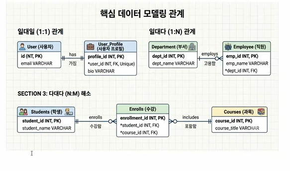


# ai-database-2026

ai에이전트 개발자 데이터베이스 리포지토리

## 1일차

### PostgreSQL 개요

- ctrl + shift + v 미리보기

데이터베이스. 데이터를 한군데에서 관리하는 목적의 시스템
줄여서 postgre, ,postgres 라고 통칭. **관계형** 데이터베이스.

`SQL`을 통해서 데이터를 저장, 수정, 삭제, 조회 할 수 있는 시스템

- 기타 관계형 데이터베이스
  - 오라클
    -mySQL /mariaDB
    -SQL Server

위 대부분 상용 소프트웨어, postgre는 **오픈소스 시스템**. 라이선스 비용x

### DB의 특징

- 데이터 무결성
- 데이터 안정성
- 데이터 동시성
- 확장성

### postgreSQL 설치

postgre

### 기본설치

- 자신의 os에 직접 설치하는 방법
- postgre -18.6-3 windows-x64.exe
- superuser 아이디 - postgres 패스워드 지정

#### Docker 개요

- 환경의존성 문제를 해결한 컨테이너 기술 솔루션
- 가상환경 상 프로그램 실행하게
- 컨테이너 - os, 라이브러리, 설정 등 하나의 패키지로 만들어진 이미
- ## dbeaver 설치해야된다 - gui 관리실행 툴
- http://dbeaver.io/download/
- 설치생략

DB 접속

1. DBeaver 실행
2. 
3. 새 데이터베이스 연결 클릭
4. 

정상접속확인

# 도커

https://docs.docker.com/desktop/setup/install/windows-install/

윈도우 버전 다운로드 후 설치

close and restart 이후

wsl 설치

윈도우쉘 관리자 모드로 들어가서

wsl --install (윈도우서버리눅스 설치)


### postgresSQL 이미지 다운로드

- 이미지 : 도커 리포지토리에 미리 만들어놓은 시스템 패키지
- 컨테이너 : 나의 도커에서 동작 중인 미리 다운로드 받은 이미지를 동작 시킨 시스템

##### 도커 명령어

```bash

docker --version

```

- 파워셀에서 실행 토커에서 postgreSQL 이미지 다운로드

```bash
docker pull postgres:latest
```

- docker desktop 전체 검색에서 pull(다운로드)

### 컨테이너 실행

#### 도커 명령어로 실행

- 여러 옵션으로 실행을 해야하므로 거의 대부분 명령어로 실행

```bash
docker run --name my-postgres -e POSTGRES_PASSWORD=123456 -p 25432:5432 -d postgres:latest
```

#### DBeaver에서 접속

## DB 기본 사용법

#### postgre 기본구조


- ai_db - 데이터베이스(프로젝트 전체 공간)
- schemas - vmfhwprxm vhfej
- Tables- 실제 데이터를 담는 표

#### Db생성

- SQL 편집기 클릭
- 새이름로 저장, *.sql로 저장
- 아래의 코드를 작성
- ```sql
  create database ai_db;
  -
  ```
- ctrl + enter로 쿼리 실행
- DB 접속 정보에서 show all databases를 체크하고 재접속
- 데이터베이스 생성확인

#### 테이블 생성

-아래의 코드작성

```sql

```


- 데이터 베이스 스키마를 사용할때 선택을 해야됨

-- 테이블 생성

```sql
 create table students (
	id int generated always as identity primary key, -- 학생 구분값 자동증가
	name varchar(50) not null, -- 이름
	age int, -- 나이
	email varchar(100), -- 이메일
	created_at timestamp default current_timestamp -- 현재 작성된 일자
);
```

### 데이터 생성

-
- insert 쿼리 작성
- ```sql
  -- 데이터 삽인(insert)
  insert into public.students (name, age, email)
  values ('홍길동', 20, 'honggd@example.com');

  insert into public.students (name, age, email)
  values ('김철수', 21, 'kim@gmail.com'),
  		('이영희', 21, 'kim@gmail.com'),
  		('박민수', 22, 'park@gmail.com'),
  		('성명건', 50, 'sung@gmail.com');
  ```
- select 쿼리 작성 -난이도가 올라감

  ```
  -- 데이터 확인(select)
  select * from public.students;
  ```
- 데이터 수정 update 쿼리
- ```

  update students set
  	email = 'hong@kakao.com'
  where id = 1;
  ```
- delete 쿼리
- ```sql
  -- 데이터 삭제(delete)
  delete from students 
  where name = '홍길동';
  ```

  - CRUD - create, read, update, delete의 약자
  - C - INSERT
  - R - SELECT
  - U - UPDATE
  - D - DELETE

##### Postgres 기본타입


| 데이터 타입 | 설명               | 예제                    |
| ----------- | ------------------ | ----------------------- |
| int         | 정수               | 10, 25, -9              |
| bigint      | 큰 정수            | 100000000               |
| varchar(n)  | 길이 제한 문자열   | '홍길동'                |
| text        | 긴 물자열(대략 2G) | 뉴스 게시물 본문        |
| boolean     | 참 또는 거짓       | true, false             |
| date        | 날짜               | 2026-09-15              |
| timestamp   | 일자(날짜와 시간)  | 2026-09-15 15:00:20.456 |
|             |                    |                         |

## 2일차

### SQL 기본

데이터베이스 내용에서 가장 기본적인 문법 CRUD

- SQL : 스트럭처 쿼리 랭기지(구조화된 질의 언어)
- 쿼리로 통칭

#### CRUD 정의

데이터** 처리의 기본 동작** 4가지


| 구분       | 의미              | 쿼리 명령어 |
| ---------- | ----------------- | ----------- |
| **c**reate | 데이터 생성(삽입) | `insert`    |
| **r**ead   | 데이터 읽기(조회) | `select`    |
| update     | 데이터 수정(변경) | `update`    |
| delete     | 데이터 삭제       | `delete`    |
|            |                   |             |

- 학생 관리 프로그램을 만든다고 가정하면,
- 학생을 등록
- 학생 목록 조회 / 특정 학생 내용 조회
- 특정  학생 내용 조회
- 학생 정보 수정
- 학생 정보 삭제

##### 데이터 생성

- 항상 select 쿼리로 확인하세요.
- insert 쿼리로 데이터 추가
- ```sql
  -- 학생 정보 추가 쿼리
  -- 쿼리문법 문자열 무조건 ''
  insert into students (name, age, email)
  values ('홍길동', 20, 'hong@example.com');

  -- 컬럼 순서 변경. 키와 값의 순서는 일치해야 함
  insert into students (age, email, name)
  values (29, 'minjun@gmail.com', '권민준');

  --여러 데이터 추가
  insert into students (name, age, email)
  values ('홍길순', 20, 'hong@example.com'),
  ('홍길자', 50, 'hong@example.com'),
  ('홍길매', 30, 'hong@example.com');
  ```

##### 데이터 조회

- select 쿼리로 조회 -[소스](./day02/practise02.sql)
- 처음에는 간단하지만, 뒤로 갈 수록 어려워짐
- ```sql
  -- 특정 컬럼만 조회
  select s.name, s.age  from students s ; 
  -- 필터링! 필요한 데이터만 조회
  select * from students s 
   where s.age < 30;

  -- 이름으로 필터링 할 때
  select * from students s
  where s.name = '홍길동';

  -- 이름과 나이로 필터링 할떄 
  select * from students s 
   where s.age = 21
     or s.name = '홍길동';

  ```

#### 데이터 활용 조회

- 정렬

  - **asc **ending : 오름차순
    **desc ending : 내림차순
  - limit - 필요갯수 만큼 조회

#### 데이터 수정

- update 쿼리로 수정 -소스
- update 쿼리 실행시 where 절없이 실행 주의 할 것

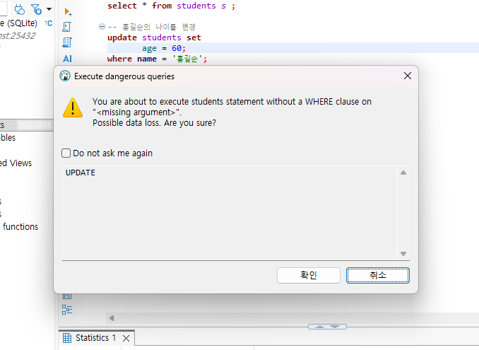

##### 데이터 삭제

- delete 쿼리로 삭제
- delete 쿼리 실행 시도 where 절 없이 실행 주의 할 것!
- 삭제도ㅗ update와 동일한 경고메시지 창 표시됨

##### 테이블 삭제

- delete는 데이터 삭제, drop은 통체로 삭제

#### null

- 값이 없다는 뜻. 숫자 0이나 빈 문자열('')와 다른 의미 ' ' 과도 다름

#### 테이블 생성 다시

-테이블 생성쿼리

```sql
--테이블 생성
CREATE TABLE students (
id INT GENERATED ALWAYS AS IDENTITY PRIMARY KEY, -- 기본키(pk) -중복안되고 not null 
name VARCHAR(50) NOT NULL, -- 이름은 null이될 수 없다
age INT, -- 나이 null
email VARCHAR(100), -- 이메일 null
major VARCHAR(50), -- 전공 null
created_at TIMESTAMP DEFAULT CURRENT_TIMESTAMP --null이 들어갈 수 있음.
);
```

#### null 사용 쿼리

```sql


-- 데이터 추가
insert into students (name, age, email, major)
values ('홍길동', 20, 'hong@example.com', '컴퓨터공학');

--전공에 널을 집어 넣는다
insert into students (name, age, email, major)
values ('성유고', 21, 'hong@example.com', null);

insert into students (name, age, email, major)
values ('성미나', null, 'mina@example.com', null);

insert into students (name)
values ('최민식');

insert into students (name, age, email, major)
values (null , null, 'hong@example.com', null);

insert into students (name, age, email)
values ('성미나', null, 'mina@example.com', null );

```

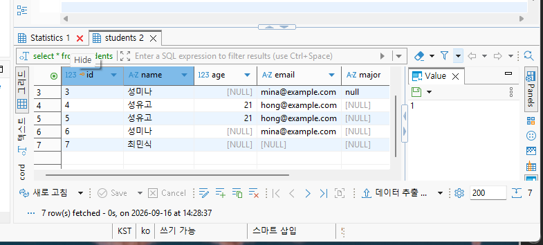

###### null 조회쿼리

```
－ where 컬럼 is null / is not null
```

### 테이블 설계

- 일반적으로 DB설계, 테이블 설계 통칭
-

#### 필요개념

－ 테이블 설계 - 논리적 테이블 설계, 물리적 테이블 설꼐

- 컬럼와 데이터 타입 선택
- 기본키(PK) /외래키(FK) 제약조건
- NOT NULL, UNIQUE, CHECK, 제약조건
- DEFAULT 제약조건
- 테이블 관계

학생과 과목 수강 관리 테이블 설계

#### 테이블 설계?

- 데이터를 어떤 테이블에 어떤 컬럼에 어떠한 관계를 가지고 저장할지 규정하는 작업
- 학생정보

  - 이름
  - 나이
  - 이메일
  - 전공
  - 수강 과목
  - 담당 강사
  - 수강 신청일
-
- 엑셀에서는 데이터를 제대로 관리하기 힘들다
-

##### 좋은 테이블 설계

- 같은 데이터가 불필요하게 중복되지 않게 한다
- 한 테이블은 하나의 주제를 가진다.
- 각 행(row)을 구분할 수 있는 기본키(PK)를 가진다
- 테이블 간의 관계가 외래키(FK)로 연결한다
- 잘못된 데이터가 들어가지 않도록 제약조건을 사용한다
- 조회, 수정이 이해하기 쉬운 구조여야 한다

##### 학생 테이블 컬럼 데이터타입 선택

`created_at`


| 구분                 |  | 설명                      | 데이터타입               |  |
| -------------------- | - | ------------------------- | ------------------------ | - |
| 학생번호`id`         |  | 학생을 구분,반드시 필요   | `int`, bigint,numeric 중 |  |
| 학생이름`name`       |  | 문자열로 추가,반드시 입력 | `varchar(50)`,text 중    |  |
| 이메일`email`        |  | 문자열, 선택으로 입력     | `varchar(200)`, text     |  |
| 나이`age`            |  | 숫자, 150살 이하로만 제약 | int...                   |  |
| 전공`major`          |  | 문자열,                   | `varchar(50`), text      |  |
| 등록일자`created_at` |  | 학생 정보를 입력한 일시   | date,`timestamp `중      |  |

- 정확한 숫자는 numeric, 긴 글은 text, 날짜만 필요하면 date, 참/거짓은 boolean
-

##### 제약조건

##### 기본키

테이블에서 각 행(row) 구분하는 대표값, Primary key(PK) - Unique에 not null

- 중복불가
- 비어있을 수 없다
- 한 행을 대표
- 다른 테이블에서 참조한다
-

postgreSQL은 `generated always as identity` 숫자 타입의 자동증가, `primary key` 가 기본키를 지정한다

`id int generated always as identity primary key`

mysql에서 auto_increment, oracl에서 identity로 문법이다름

##### 2. 외래키

다른 테이블의 기본키를 참조하는 컬럼. Foreign Key(FK)

```plaintext
students
-id : 학생아이디 pk
-name : 학생이름

enrollment(수강)
-id :수강아이디 pk
-students_id :학생아이디 FK
-course_name :학생이름


```

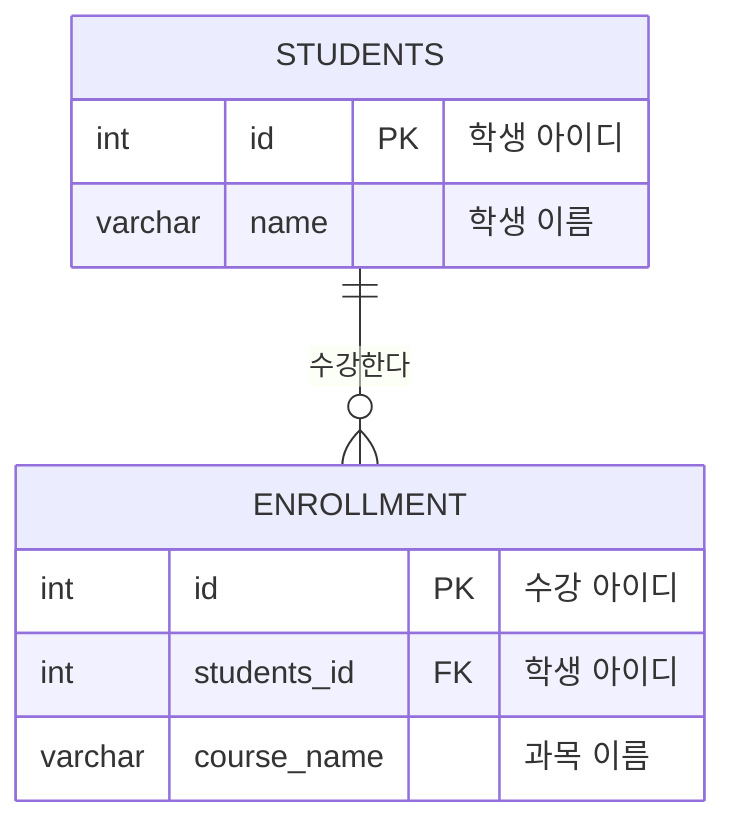

Diagram
STUDENTS ||--o{ ENROLLMENT : "수강한다"

STUDENTS {
int id PK "학생 아이디"
varchar name "학생 이름"
}

ENROLLMENT {
int id PK "수강 아이디"
int students_id FK "학생 아이디"
varchar course_name "과목 이름"
}

# 3일차

### 추가 쿼리

- 테이블 수정쿼리 - 이미 만들어진 상태의 테이블을 수정하는 쿼리
- ```sql
  alter table students
  alter column "email" type varchar(100);
  ```

#### 제약조건

#### PK/FK 관계

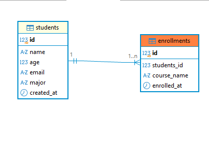

- students 부모테이블 - enrollments 자식테이블

#### not null 제약조건

- 해당 컬럼은 반드시 값이 들어가야 한다
- ```sql
  name varchar(50) not null
  ```
- 아래의 쿼리는 오류가 발생함
- ```sql
  --데이터 삽입
  insert into students (age, major)
  values (23, '경영학과');
  ```

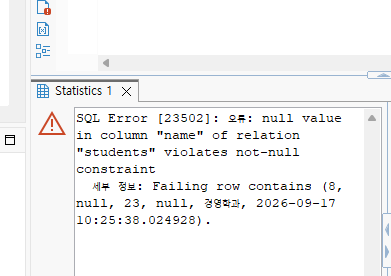

students 테이블에 name은 not-null 제약조건으로 반드시 입력해야하는데 현재 없기 때문에 오류

- 이젠에 생성된 컬럼을 not null로 변경하는 쿼리
- ALTER TABLE public.students ALTER COLUMN email SET NOT NULL;
- 오류화면 뜬다
- not null로 변경불가 할때 생기는 오류 화면
- 이전 테이블에 새 컬럼 추가할때 not null 로만은 생성 불가. null로는 생성가능

#### unique 제약조건

- 중복이 허용되지 않는 제약조건
- 보통 이메일이 다른 사용자와 중복은 허용하지 않으나, 내 이메일은 다른 걸로 변경가능

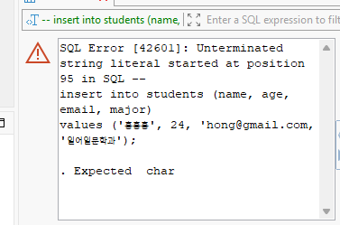

#### check 제약조건

- 값이 특정 조건을 만족해야만 저장되는 제약조건
- 초등학교 학년: 1-6
- 대학교 학년 : 1-4
- 나이 : 0세이상, 200세 이하
- 금액 : 1000원 이상
- int 타입은 -21억 -21억까지 수를 저장. 모두 허용하면 학년에 음수나 0, 1-4 이상의 다른 수 입력 가능
- 이를 방지해서 정확한 데이터만 입력
- 학년 컬럼 추가
- ```sql
  ALTER TABLE public.students ADD grade int NULL;
  ```

#### default 제약조건

-값을 입력하지 않으면 자동으로 들어가는 기본값

```sql
created_at timestamp default crrent_timestamp
```

- 쿼리
- ```sql
  stock int default 0
  created_at timestamp default currunt_timestamp
  ```

### 테이블 모델링

관계형 DB에는 테이블간 관계에 몇 가지 관계성이 존재


| 관계   | 설명                                              | 예시                     |
| ------ | ------------------------------------------------- | ------------------------ |
| 일대다 | 부모 테이블 한 행이 자식 테이블 여러 행과 연결    | 학생과 수강 신청 관계    |
| 일대일 | 테이블 한 행이 자식 테이블 한 행과 연결           | 사용자와 사용자 상세정보 |
| 다대다 | 부모테이블 여러행이 자식테이블 여러행과 연결될 때 | 학생과 과목              |

- 다대다 관계는 DB에서 구현 불가, 일대다 / 일대다 관계로 분리해서 구현
-
- 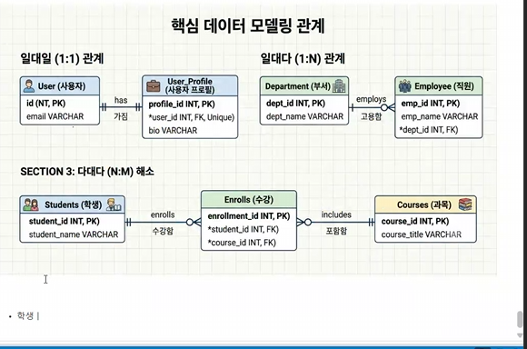
- 학생 한명은 여러 과목을 수강할 수 있음
- 과목 하나에는 여러 학생이 수강할 수 있음
-
- 학생 테이블 주요정보
  - 이름, 이메일, 나이, 전공
- 과목 테이블 주요정보
  - 타이틀, 강사, 시수
- 수강 신청 주요정보
  - 수강 학생정보 구분값, 과목 정보 구분값

#### 모델링 툴

- erd cloud 사이트
- ERD(entity relationship diagrma)


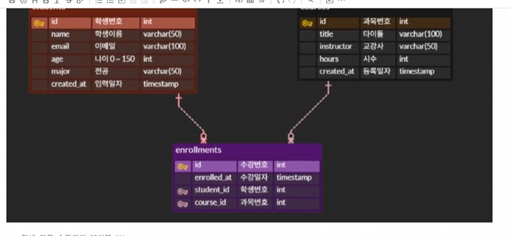

- 학생 관목 수강관리 테이블 ERD

### join

관계형 데이터베이스에서 여러개로 나눈 테이블의 정보를 다시 하나로 합쳐서 조회하는 것

#### join 필요이유

관계형 DB는 데이터를 하나의 통 테이블에 넣지 않고, 주제에 따라서 여러 테이블에 나누어 저장함

- 학생, 과모그 수강 테이블에서
  - 수강신청 정보 - 학생테이블과 과목테이블을 수강테이블의 구분키 연결 하는 것

#### inner join

- 조건이 서로 일치하는 데이터만 조회
- 테이블 관계 확인하고 관련있는 pk와 fk로 조인할 것!
- 같은 의미를 가진 컬럼들이 존재하므로 select * 보다는 select 컬럼을 나열
- 같은 단어를 가진 컬럼명은 "별명"으로 변경할 것
- ```pgsql
  -- join
  select s.id "학생번호", s.name "학생이름", s.email "이메일", s.major "전공",
  		e.id "수강번호", e.enrolled_at "수강일자",
  		c.id "과목번호", c.title "과목명", c.instructor "교강사명", c.hours "총시간"  
   from students s 
  inner join enrollments e
  on s.id = e.student_id 
  inner join courses c
  on c.id = e.course_id;
  ```

```abc

```

#### join 후 조건으로 조회

- 학생 번호로 조회, 특정 전공으로 조회 등...
- where 절 사용

#### join 후 정렬

- order by asc/desc

#### outer join

- 조건이 일치하지 않아도 조회
- 기준이 left, right 두 가지 존재
- left outer join 왼쪽 테이블 기준으로 오른족 테이블에 연결되지 않은 데이터도, 나오도록 조회
- right outer join - left outer join의 반대

#### 집계함수

- 통계를 위해서 합산, 평균, 최소/최대등 집계함수를 사용하여 계산하는 쿼리
- count(*), sum(컬럼), avg(컬럼), min(컬럼), max(컬럼) - 숫자로 된 컬럼
- gruop by 사용시 select * 사용불가, 필요 컬럼과 집계함수 반드시 사용

### 트랜잭션

- 여러 sql  작업을 하나의 단위로 묶은 기능, 모든 작업이 성공하면 commit, 오류가 발생하며 rollback 하는 개념
- acid
  - a 원자성 : 작업 전체가 반영되거나 취소된다.
  - c 일관성 : 트랜잭션 전후에 데이터 규칙이 유지된다.
  - i 고립성 :트랜잭션 동안은 밀폐되어야 한다
  - d 지속성 : 커밋된 데이터는 장애가 발생해도 보존된다.
  -
- 커밋, 롤백

#### 트랜잭션 필요 키워드 명령어

- 트랜잭션 시작 명령어

```pgsql
begin; 
bdgin transaction;

```

- 확정
- ```pgsql
  commit;
  ```
- 취소/복귀/롤백
- ```pgsql
  rollback;
  ```

#### 트랜잭션 설정

- postgreSQL 기본 트랜잭션이 실행
- 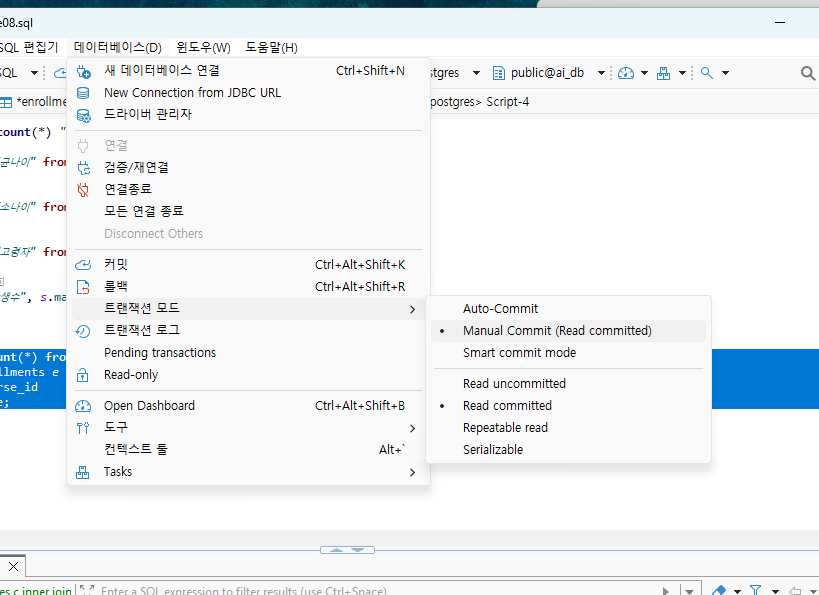
- 트랜잭션 모드로 변경 해야됨 auto commit으로 하면 안된다 -메뉴얼 커밋으로 바꿔야된다
- dbeaaver에서 트랙잭션 설정해야됨
- 메뉴 데이터베이스 > 트랜젝션 모드> 메뉴얼 모드로 변경


#### 트랜잭션 실습

- auto-commit 상태에서 테이블 생성
- 메뉴얼 커밋으로 변경
- 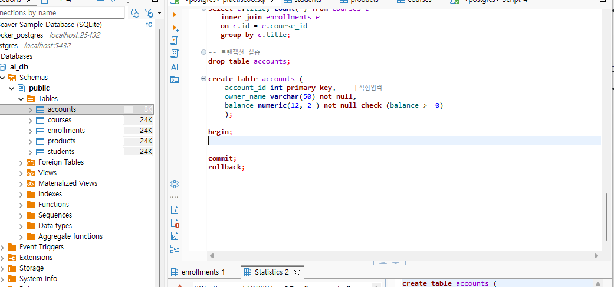
- begin(dbeaver에서 자동으로 트랜잭션 시작), `commit`, `rollback`
-


[다음](./README2.md)
