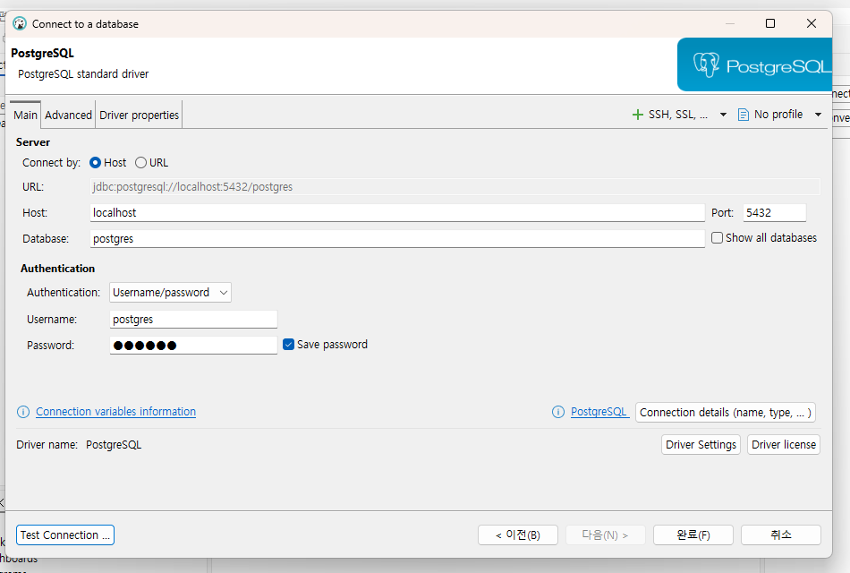
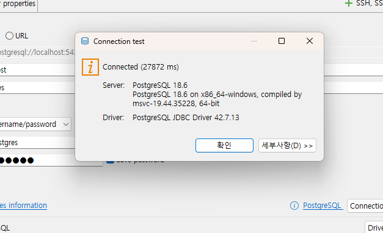
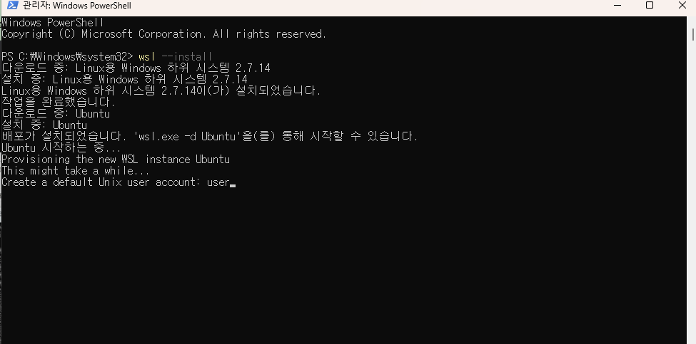
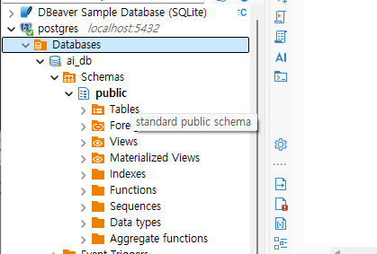
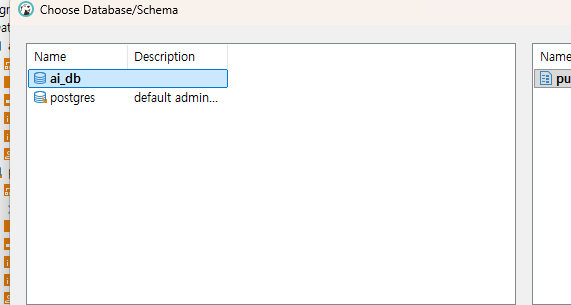

# ai-database-2026

ai에이전트 개발자 데이터베이스 리포지토리

## 1일차

### PostgreSQL 개요

- ctrl + shift + v 미리보기

데이터베이스. 데이터를 한군데에서 관리하는 목적의 시스템
줄여서 postgre, ,postgres 라고 통칭. **관계형** 데이터베이스.

`SQL`을 통해서 데이터를 저장, 수정, 삭제, 조회 할 수 있는 시스템

- 기타 관계형 데이터베이스
  - 오라클
    -mySQL /mariaDB
    -SQL Server

위 대부분 상용 소프트웨어, postgre는 **오픈소스 시스템**. 라이선스 비용x

### DB의 특징

- 데이터 무결성
- 데이터 안정성
- 데이터 동시성
- 확장성

### postgreSQL 설치

postgre

### 기본설치

- 자신의 os에 직접 설치하는 방법
- postgre -18.6-3 windows-x64.exe
- superuser 아이디 - postgres 패스워드 지정

#### Docker 개요

- 환경의존성 문제를 해결한 컨테이너 기술 솔루션
- 가상환경 상 프로그램 실행하게
- 컨테이너 - os, 라이브러리, 설정 등 하나의 패키지로 만들어진 이미
- ## dbeaver 설치해야된다 - gui 관리실행 툴
- http://dbeaver.io/download/
- 설치생략

DB 접속

1. DBeaver 실행
2. 
3. 새 데이터베이스 연결 클릭
4. 

정상접속확인


# 도커


https://docs.docker.com/desktop/setup/install/windows-install/

윈도우 버전 다운로드 후 설치

close and restart 이후

wsl 설치

윈도우쉘 관리자 모드로 들어가서

wsl --install (윈도우서버리눅스 설치)




### postgresSQL 이미지 다운로드

- 이미지 : 도커 리포지토리에 미리 만들어놓은 시스템 패키지
- 컨테이너 : 나의 도커에서 동작 중인 미리 다운로드 받은 이미지를 동작 시킨 시스템


##### 도커 명령어

```bash

docker --version

```

- 파워셀에서 실행 토커에서 postgreSQL 이미지 다운로드

```bash
docker pull postgres:latest
```

- docker desktop 전체 검색에서 pull(다운로드)


### 컨테이너 실행

#### 도커 명령어로 실행

- 여러 옵션으로 실행을 해야하므로 거의 대부분 명령어로 실행

```bash
docker run --name my-postgres -e POSTGRES_PASSWORD=123456 -p 25432:5432 -d postgres:latest
```

#### DBeaver에서 접속

## DB 기본 사용법

#### postgre 기본구조



- ai_db - 데이터베이스(프로젝트 전체 공간)
- schemas - vmfhwprxm vhfej
- Tables- 실제 데이터를 담는 표

#### Db생성

- SQL 편집기 클릭
- 새이름로 저장, *.sql로 저장
- 아래의 코드를 작성
- ```sql
  create database ai_db;
  -
  ```
- ctrl + enter로 쿼리 실행
- DB 접속 정보에서 show all databases를 체크하고 재접속
- 데이터베이스 생성확인

#### 테이블 생성

-아래의 코드작성

```sql

```



- 데이터 베이스 스키마를 사용할때 선택을 해야됨

-- 테이블 생성


```sql
 create table students (
	id int generated always as identity primary key, -- 학생 구분값 자동증가
	name varchar(50) not null, -- 이름
	age int, -- 나이
	email varchar(100), -- 이메일
	created_at timestamp default current_timestamp -- 현재 작성된 일자
);
```


### 데이터 생성

-
- insert 쿼리 작성
- ```sql
  -- 데이터 삽인(insert)
  insert into public.students (name, age, email)
  values ('홍길동', 20, 'honggd@example.com');

  insert into public.students (name, age, email)
  values ('김철수', 21, 'kim@gmail.com'),
  		('이영희', 21, 'kim@gmail.com'),
  		('박민수', 22, 'park@gmail.com'),
  		('성명건', 50, 'sung@gmail.com');
  ```


- select 쿼리 작성 -난이도가 올라감

  ```
  -- 데이터 확인(select)
  select * from public.students;
  ```
- 데이터 수정 update 쿼리
- ```

  update students set
  	email = 'hong@kakao.com'
  where id = 1;
  ```


- delete 쿼리
- ```sql
  -- 데이터 삭제(delete)
  delete from students 
  where name = '홍길동';
  ```

  - CRUD - create, read, update, delete의 약자
  - C - INSERT
  - R - SELECT
  - U - UPDATE
  - D - DELETE

##### Postgres 기본타입


| 데이터 타입 | 설명               | 예제                    |
| ----------- | ------------------ | ----------------------- |
| int         | 정수               | 10, 25, -9              |
| bigint      | 큰 정수            | 100000000               |
| varchar(n)  | 길이 제한 문자열   | '홍길동'                |
| text        | 긴 물자열(대략 2G) | 뉴스 게시물 본문        |
| boolean     | 참 또는 거짓       | true, false             |
| date        | 날짜               | 2026-09-15              |
| timestamp   | 일자(날짜와 시간)  | 2026-09-15 15:00:20.456 |
|             |                    |                         |
