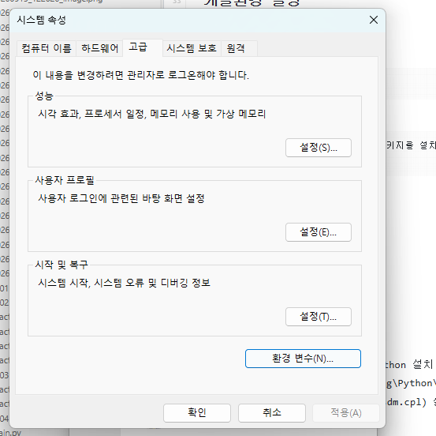
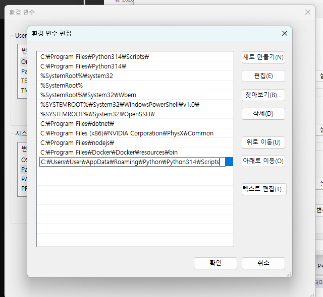
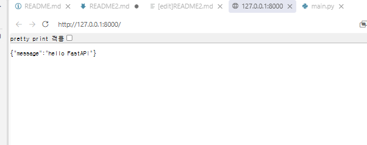
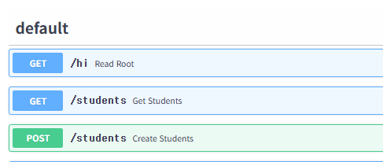
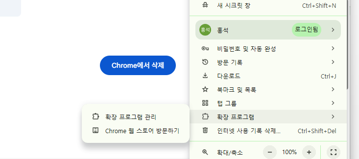
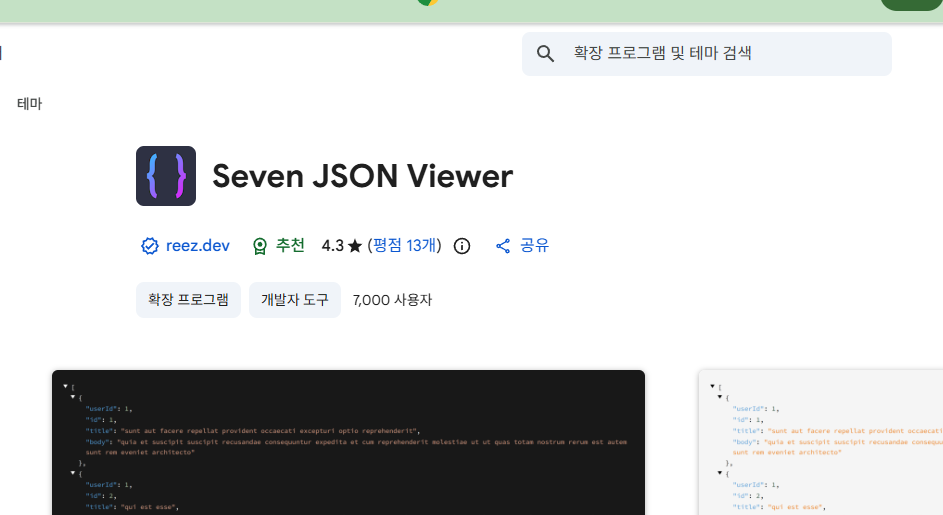

# Fast API

## 개요

- fastApi - python으로 api 서버를 만드는 웹 프레임워크
- API - application programming interface
- 사용자(클라이언트)가 웹, 모바일, 앱에서 요청을 하면 fastapi 서버가 요청을 철, 결과를 돌려줌
- JSON - 타입(파이썬 딕셔너리와 유사)으로 결과 리턴
- 예

```plaintext
사용자(클라이언트)
-> get / students 요청
-> fastapi 서버에서 db를 조회
-> 학생목록 결과 json 응답
```

- 클라이언트(요청 request) -> 서버(응답 response)

### FastApi 특징

- python 문법으로 api를 만들 수 있음
- 코드가 간결하다
- 실행 속도가 빠르다
- 테스트를 위한 UI를 자동으로 만들어 줌
- Pydantic을 사용, 요청과 응답 데이터를 검증할 수 있다
- postgreSQL, Mysql, Oracle 등 DB와 연동이 쉽다

### API 서버

클라이언트 요청을 받아 필요한 작업을 수행, 그 결과를 클라이언트에게 돌려주는 프로그램

### 개발환경 설정

#### fastapi 패키지 설정

```bash
pip install fastapi uvicorn
```

```
- 현재 파이썬에 fastapi와 uvicorn 패키지를 설치
fastapi 개발 가능
```

pip list

- 패키지 설치 확인

### 기초 FastAPi 서버

- 소스 작성
- vscode 재시작

### 문제해결

- 설치한 uvicorn.exe 위치가 python 설치 위치와 다르다
- C:\Users\User\AppData\Roaming\Python\Python314\Scripts
- 윈도우 검색- 시스템 속성 ***(sysdm.cpl)*** 실행
- 
- 시스템변수에 path에서 주소를 확인
- 

더블클릭해서 경로를 넣어줘야된다. - 확인 -확인 -확인

- 시스템 변수내 path 상세에서 파이썬 경로 추가 - 확인 - vscode, 터미널 재시작
- uvicorn은 파이썬으로 만든 웹 애플리케이션을 브라우저나 외부에서 접속 할 수 있도록 서버를 띄워주는 초고속 웹 서버 프로그램

### fastapi 서버시작

```bash
uvicorn main.app --reload --port 8000
```

- --reload : 수정되면 곧바로 반영되어서 서버 재시작
- --port 8000 : 서버를 시작할 포트 지정
- http://127.0.0.1:8000 메시지 확인

  - 127.0.0.1-> localhost
  - 

### fastapi 기본학습

#### 웹 응답코드

- 200 : ok 웹페이지에 문제없음
- 404 : page not fount 클라이언트가 요청한 페이지나 데이터가없음
  500 : internal server error 내부 서버 오류

#### swagger ui 확인

- FastAPi에서 자동으로 제공하는 APi 테스트 페이지
- HTTP(s)://address:port//docs
- api의 결과는 json 타입(문자열 일반적으로 "로 표현),파이썬 딕셔너리 ' 로 표현하는 것과 차이점

#### url 경로

- URL기본 `http(s)://address:port`
  - address - 127.0.0.1 또는 192.168.0.105 등 아이피주소, www.naver,com 등의 도메인주소
  - port - 0~ 65535가지의 숫자
- `/ `- root 기본되는 페이지
- `/students `- 추가 url.RestFull URL
- `/students/1` - 추가 url. 경로 파라미터
- `/?key=value&key=valu`e -url 경로 GET 쿼리 파라미터

#### http(s) 메서드

FastAPI는 주소와 HTTP 메서드도 파악필요


| 메서드   | 의미             | 예시                        |
| -------- | ---------------- | --------------------------- |
| `get`*   | 데이터 조회      | 학생목록조회, 특정학생 조회 |
| `post`*  | 데이터 생성      | 학생등록 / 예전 수정과 삭제 |
| `PATCH`  | 데이터 일부 수정 | 학생 전공 수정              |
| `PUT`    | 데이터 전체 수정 | 학생 정보 전체 수정         |
| `DELETE` | 데이터 삭제      | 학생정보 삭제               |

- get 메서드 외에는 swagger ui에서 테스트 해야한다 .post, put ,patch, delete



#### 요청 본문

- post나 oatch 요청시는 클라이언트가 json으로 데이터를 서버에 전달해야 함. 그 데이터를 등록 또는 수정.
- fastAPi에서는 pydantic 패키지 모델을 사용
- json 데이터이므로 파이썬 none 대신 null 사용
- } 닫기전 , 는 제거 (파이썬은 허용)





설치하면 좋다

#### 메모리기반 (DB x) 학생 API 예제

- day05/memordb.py
- get method 함수 내용생략
- post 메서드 작성
- swagger 테스트


#### HTTPExceptioon

- api 상에 오류가 발생하면 오류(예외)처리를 진행
  -  | 상태코드   | 의미                   |
    | :--------- | ---------------------- |
    | `200`, 201 | 요청성공, 생성 성공    |
    | 403,`404`  | 권한 없음, 데이터 없음 |
    | `500`      | 서버 오류              |
    |            |                        |
